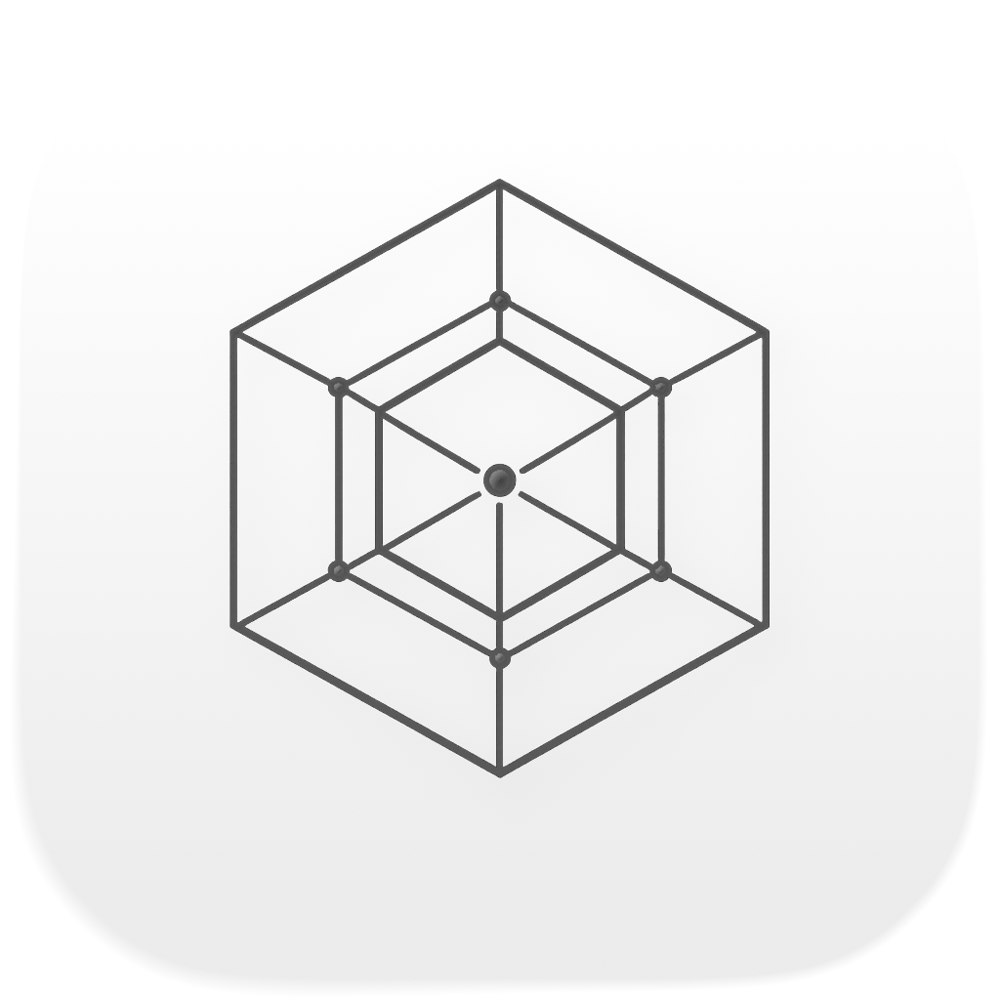
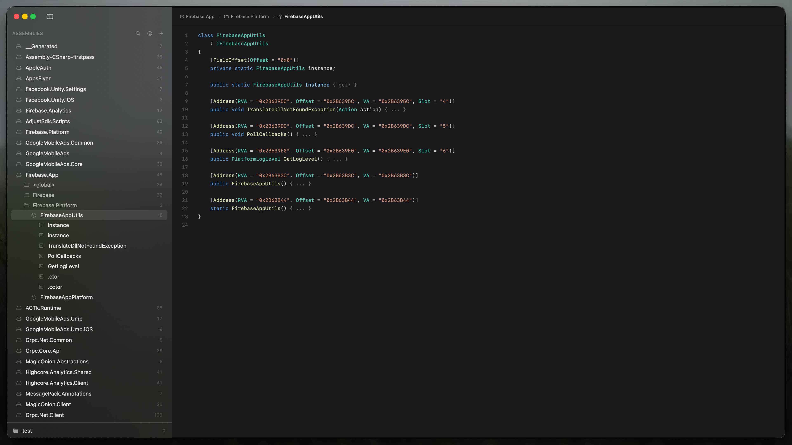

<p align="center">
  
  <br><br>
  <b><samp>FERRITE</samp></b>
  <br>
  <sub>A high-performance native macOS .NET inspector and decompiler, built with <b>Rust</b> and <b>Swift</b>.</sub>
  <br><br>
  
  
  
  
  
</p>

<br>

<p align="center">
  
</p>

<br>

## Why Ferrite

Ferrite is purpose-built for macOS. A Rust core handles all PE/CLR metadata parsing and IL decompilation at native speed, while a SwiftUI frontend delivers a responsive, familiar Mac experience. No Electron, no JVM — just compiled code optimized for Apple Silicon.

## Features

- **Assembly browser** — explore assemblies through a structured sidebar tree: assembly → namespace → type → member
- **C# decompilation** — IL bytecode lifted to readable C# with full type signatures, generics, and attributes
- **Multi-assembly projects** — group related assemblies into projects that persist between sessions
- **Fuzzy search** — `Cmd+K` to instantly search across all loaded types and members
- **Drag-and-drop** — drop `.dll` / `.exe` files directly onto the window to load them
- **Code export** — `Cmd+E` saves the current decompiled view as a `.cs` file
- **Memory-mapped I/O** — assemblies are memory-mapped for minimal RAM usage and fast load times
- **Lazy loading** — type summaries load on startup; full details are fetched on demand

## Requirements

- macOS 26 (Tahoe)+
- Xcode 16+, Rust 1.80+
- `xcodegen` — `brew install xcodegen`

## Install

Download the latest `.dmg` from [Releases](../../releases), mount, drag **Ferrite.app** to `/Applications`.

> **macOS Gatekeeper:** Since Ferrite is not notarized, macOS may show *"Apple could not verify"*. To fix this, run:
> ```bash
> xattr -cr /Applications/Ferrite.app
> ```
> Or right-click the app → **Open** → **Open** to bypass the warning.

## Build from source

```bash
git clone https://github.com/Batchhh/Ferrite.git
cd Ferrite
make all
open Ferrite.xcodeproj   # then Cmd+R
```

See [docs/building.md](docs/building.md) for details.

## Architecture

```
SwiftUI app  ──UniFFI──▸  Rust static library
(src/swift/)              (src/rust/)
```

The Rust backend (`ferrite-pe`) parses PE headers, CLR metadata, and decompiles IL bytecode. The FFI boundary (`ferrite-ffi`) uses UniFFI proc-macros to generate Swift bindings automatically. The SwiftUI frontend consumes these bindings through an `@Observable` service layer.

See [docs/architecture.md](docs/architecture.md) for a full breakdown.

## Contributing

See [CONTRIBUTING.md](CONTRIBUTING.md).

## License

MIT — see [LICENSE](LICENSE).
