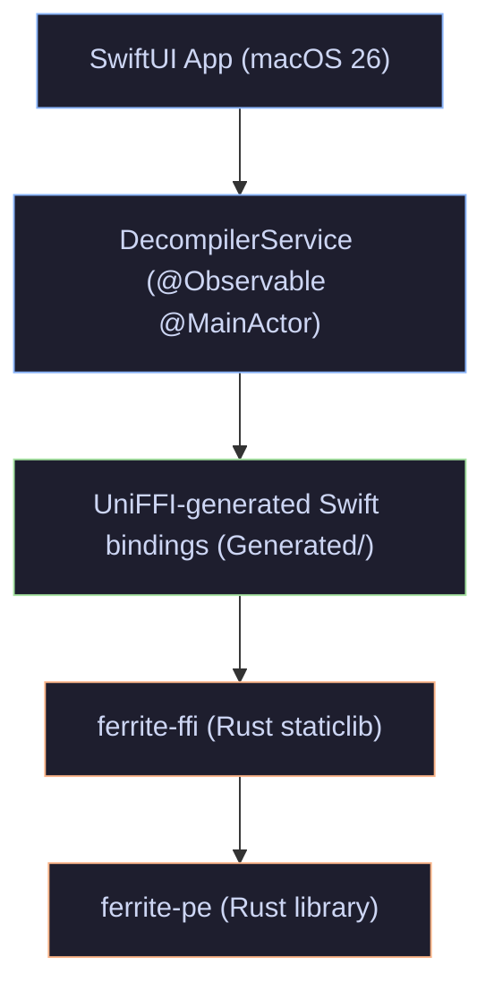
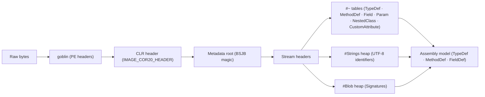
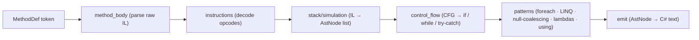
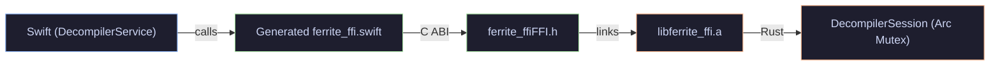
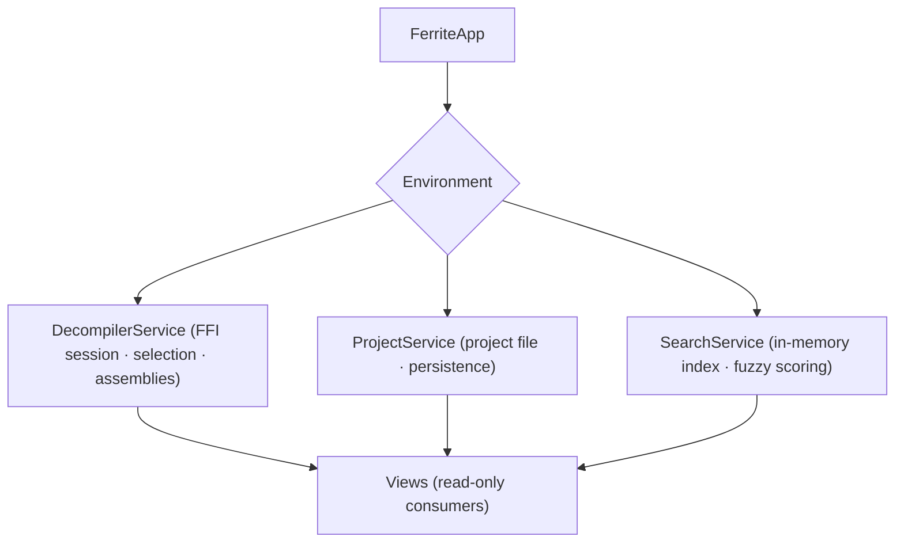
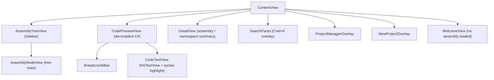

# Architecture

Ferrite is split into two halves: a Rust backend that understands .NET binary formats, and a Swift/SwiftUI frontend. The two halves communicate through a generated FFI boundary powered by [UniFFI](https://mozilla.github.io/uniffi-rs/).

---

## Layer overview

| Layer | Language | Role |
|---|---|---|
| `ferrite-pe` | Rust | Parses PE headers, CLR metadata tables, IL bytecode; lifts IL → C# AST |
| `ferrite-ffi` | Rust | UniFFI-annotated boundary; compiles to `libferrite_ffi.a` |
| `FerriteFFI` | C | Thin module target exposing the generated header to Swift |
| `Ferrite` | Swift/SwiftUI | UI: sidebar, code view, search, project management |

---

## Assembly parsing pipeline

Key facts:
- Table rows are 1-indexed. Tokens encode the table ID in the high byte: `TypeDef=0x02`, `MethodDef=0x06`, `Field=0x04`.
- `TypeDef` row 1 is always the `<Module>` pseudo-type and is filtered out.
- The `NestedClass` table maps child → parent; after parsing, nested types are removed from the top-level list and attached to their parent's `nested_types` vec.

### TypeKind detection

| Condition | Kind |
|---|---|
| `flags & 0x20 != 0` | `Interface` |
| extends `System.Enum` | `Enum` |
| extends `System.ValueType` | `Struct` |
| extends `System.MulticastDelegate` | `Delegate` |
| otherwise | `Class` |

---

## Decompiler pipeline

Patterns run in registration order; more specific patterns are registered before more general ones.

---

## FFI boundary

UniFFI proc-macro mode — no `.udl` files. Annotations are applied directly on Rust types:

| Annotation | Used for |
|---|---|
| `#[derive(uniffi::Object)]` | `DecompilerSession` — Arc-wrapped, reference-counted across FFI |
| `#[derive(uniffi::Record)]` | Struct types passed by value (cloned at boundary) |
| `#[derive(uniffi::Enum)]` | Enums |
| `#[derive(uniffi::Error)]` | `FerriteError` — propagated as Swift `throws` |

Naming: Rust `snake_case` fields → Swift `camelCase` automatically (e.g. `full_name` → `fullName`). Swift keyword enum variants are backtick-escaped: `` .`class` ``, `` .`struct` ``.

---

## Swift app

### State management

All service properties are `@MainActor`. FFI calls run in `Task.detached` and marshal results back with `await MainActor.run`.

### View hierarchy

